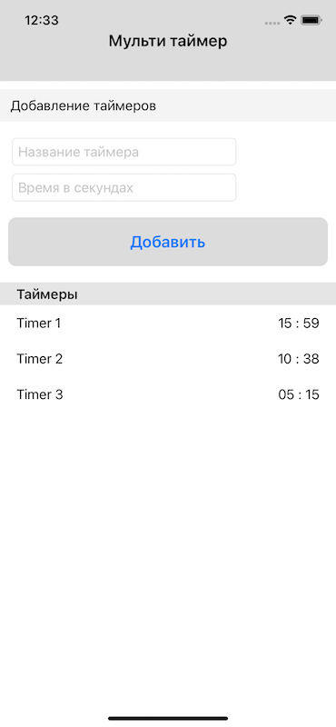
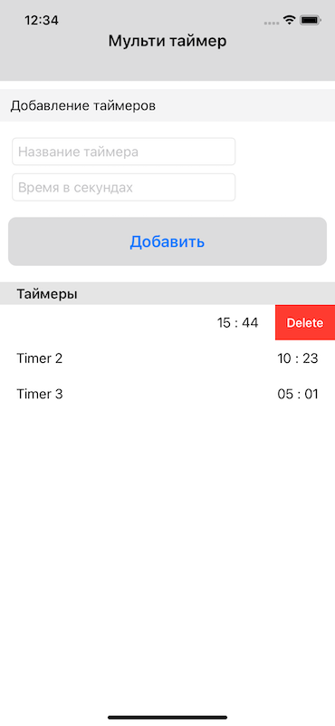

# MultiTimer
### Тестовое задание

## Задача
#### Необходимо написать приложение Мульти-таймер. Требования к приложению:
1. При нажатии на кнопку "Добавить" добавляется ячейка в таблицу и запускается таймер обратного отсчета.
2. При добавлении нового таймера таблица отсортировывается в порядке убывания.
3. После завершения времени таймер удалется из таблицы.

## Результат

